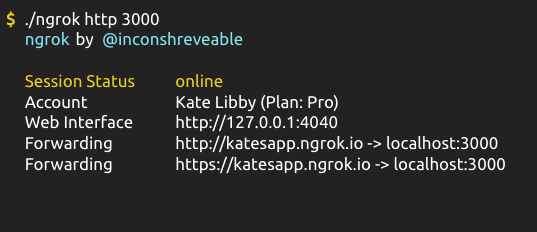

# Catbot Chatbot

This is a Slack based Chatbot which pulls images fom [Google Custom Search](https://developers.google.com/custom-search/).

This was used for my `DDDSydney 2018` presentation `Introduction into Serverless or: How to run a simple chatbot side project for cheap`.

## Getting Started

Note, if you run into any major issues along the way, hit me up in Github Issues, Twitter or via Email! There are probably a few bugs/jumps that I didn't quite explain properly.

### Prerequisites

There are four parts to setting up this project:

- [AWS Account](https://aws.amazon.com/)
- [Serverless](http://serverless.com/)
- [Slack Bot](https://api.slack.com/)
- [Google Custom search](https://developers.google.com/custom-search/)

Details to set up each section are below:

- [Create an AWS account](/docs/aws.md)
- [Setup and deploy the serverless app](/docs/serverless.md)
- [Create a Slack Bot](/docs/slack.md)
- [Set up Google Custom Search](/docs/google-custom-search.md)

Theoretically, if you follow these steps, you should have a fully functioning Slack Chatbot!

If there are any issues with the tutorial, please create an `Issue` in this repo explaining the problem and I'll update it!

## Running locally

You may want to make changes and run this locally for testing.

To run a local instance, in your temrinal, run:
```
npm start
```
This will spin up the app at `localhost:3000`.

At the time of writing, the easiest way to run this in slack is to download and install [ngrok](https://ngrok.com/).

`ngrok` creates a custom Public Url for one of your local ports.

When you have installed the app, run:
```
ngrok http 3000
```

This will create a public URL that will point to your `localhost:3000` port.

Copy the ngrok generated URL and update the `Slack Event Subscription` endpoint with your ngrok url:



## Deployment

To deploy changes to your app, run:

```
sls deploy
```

## Built With

* [Serverless](https://serverless.com/) - The Serverless framework used

## Authors

* **Ben McPhail** - [github](https://github.com/benmcp), [website](http://www.benmcphail.com/)

## License

MIT
