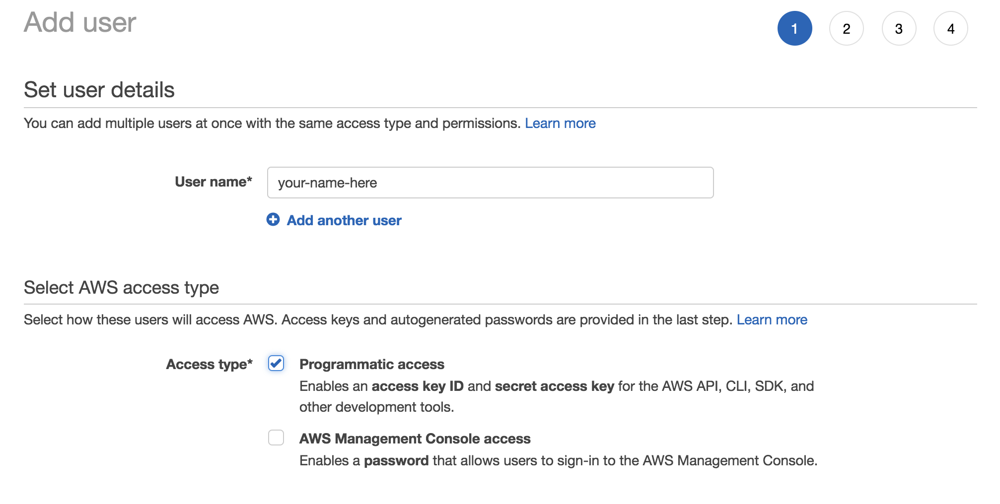
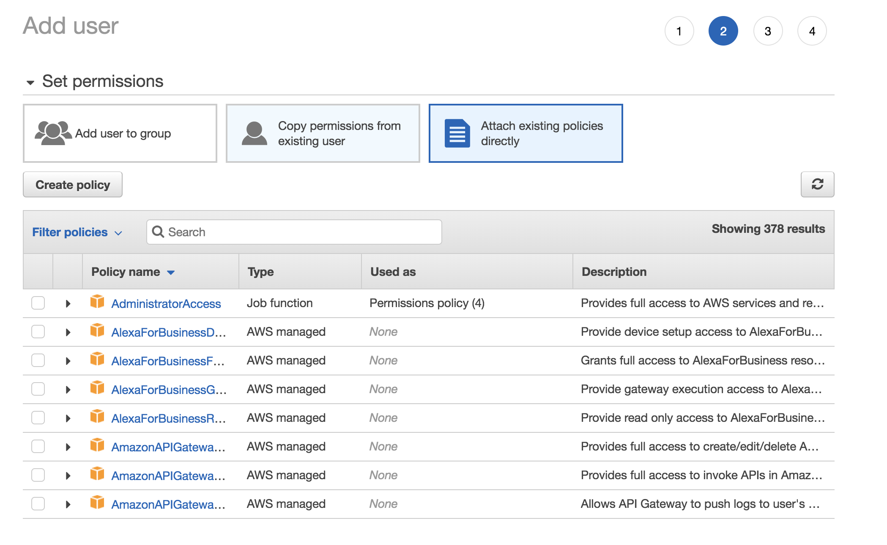
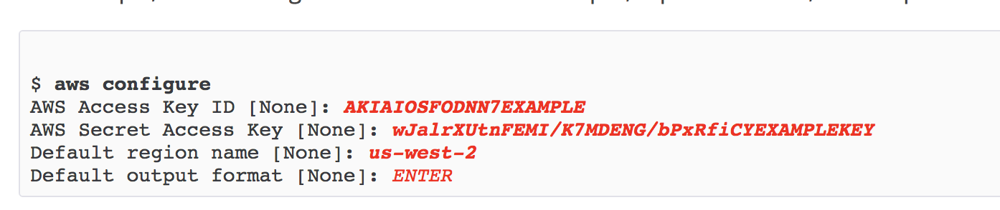

# Setting up AWS

This is a guide to how to set up an AWS Account and how to install the [AWS CLI](https://aws.amazon.com/cli/)

## Create an AWS account

[Create an AWS account](https://portal.aws.amazon.com/billing/signup?nc2=h_ct&redirect_url=https%3A%2F%2Faws.amazon.com%2Fregistration-confirmation#/start). This will require a Credit/Debit Card but costs for this application will be quite low.

If you want to check, once you are logged in, you can see the [billing here](https://console.aws.amazon.com/billing/home#/).

## Create a new user via AWS Identity and Access Management (IAM)

Once you've logged into AWS, navigate to the IAM or [click here](https://console.aws.amazon.com/iam/home). This is where you manage access to all the AWS Services.

Create a new user and enable programatic access:



Click `Attach existing policies directly` and select `Administrator Access`



Click `Next: Review` and then `Create User`.

Download the .csv or keep note of the `Access key ID` and `Secret access key`, we'll use this later.

## Setup AWS CLI

### AWS CLI
The AWS CLI (Command Line Interface) will let your serverless application connect and deploy to AWS.

Details to install the CLI are available [here](https://aws.amazon.com/cli/). Essentailly if you use Windows, download via an installer, else if you have a Linux or Mac, you can install the CLI via pip (Python Package Manager - Similar to NPM).

Once this is installed, in your temrinal, run the following commamd, follow the prompts and paste in your `Access key ID` and `Secret access key`.

```
aws configure
```



How you're setup with AWS!
