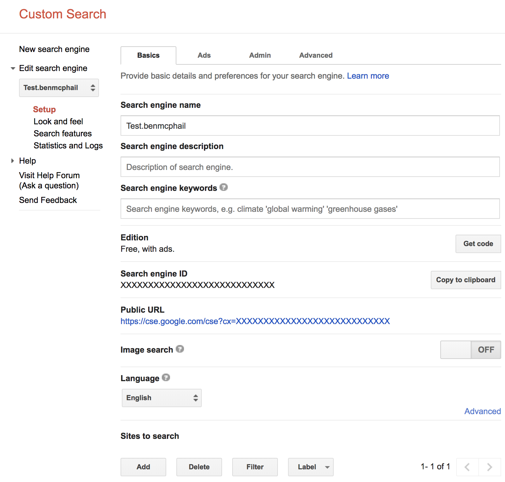
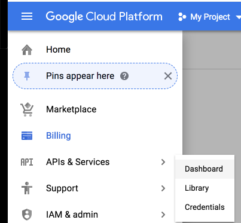

# Google Custom Search

There are two parts to this, creating a custom search and then enabling billing for your Gooogle Account.

## Creating a custom search

1. Go to [Custom Search](https://cse.google.com/cse/all)
2. Click `Add` to add your own custom engine
3. Add a custom site into `Sites to search`. We wont be using this but is required to enable this feature
4. Fill in the `Name of the search engine` field and click `create`
5. In the LHS sidebar, select the newly created Custom Search and click `Setup`
6. In the settings, enable `Image search`
7. Copy the `Search engine ID` to the `.env` file and save it as `CSE_ID`

7. Scroll down to `Programmatic Access` and click `Get Started` for `Custom Search JSON API`
8. On the [JSON Custom Search API: Introduction](https://developers.google.com/custom-search/json-api/v1/introduction), click `Create a key` and save the generated token in the `.env` file as `CSE_API_KEY`
9. Run `sls deploy` in the terminal to redeploy the app with the newly added Custom Search keys

## Set up billing

1. Log into `Google cloud` and navigate to the [billing section](https://console.cloud.google.com/billing)
2. Create a billing account and fill out the details
3. In the LHS tab, click `API & Services` > `Dashboard`

4. Select the newly created `Custom Search API`

5. Click `quotas`
6. On the RHS, edit `Queries per day` and update this to match your predicted usage volume

The Google Cloud account offers you $200 free credit each month. Pricing for the google custom search can be [found here](https://developers.google.com/custom-search/json-api/v1/overview#pricing). Assuming your usage isn't excessive, you should exceed the $200 free monthly credit!
