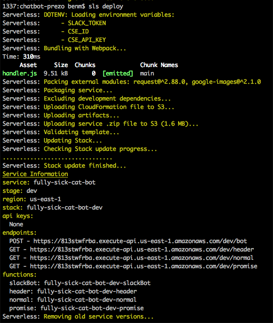

# Install serverless

1. Download and install `servereless`
```
npm install -g serverless
```
2. At the base of repo, install the npm packages:
```
npm install
```
3. Deploy the app to AWS
```
sls deploy
```


4. Keen note the `POST Endopint`, i.e. `https://XXXXXXX.execute-api.us-east-1.amazonaws.com/dev/bot`
