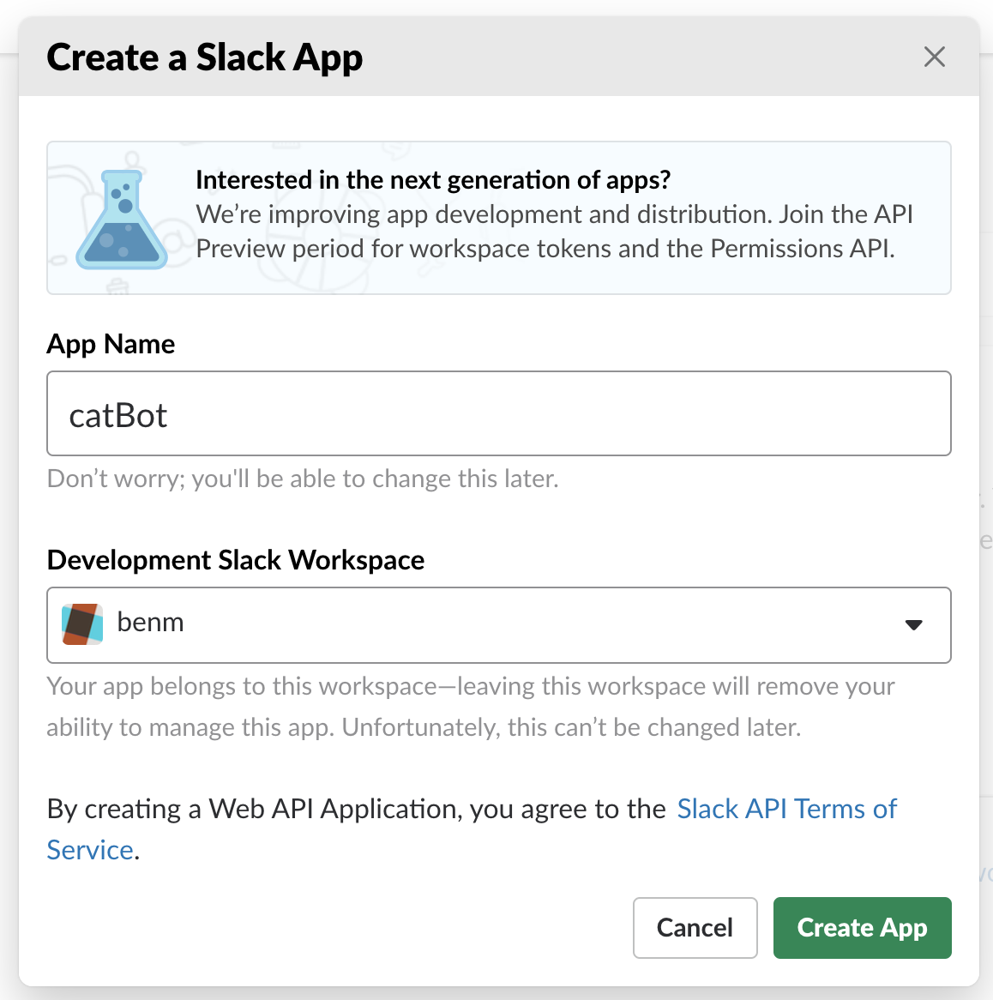
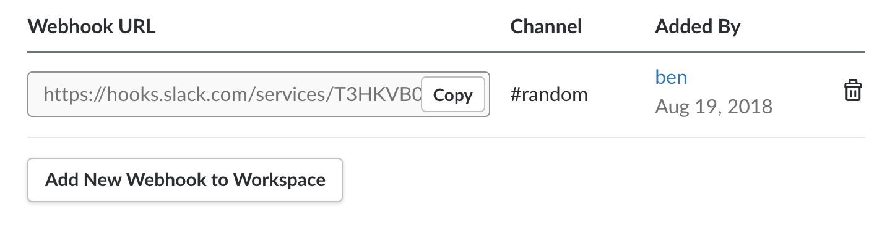
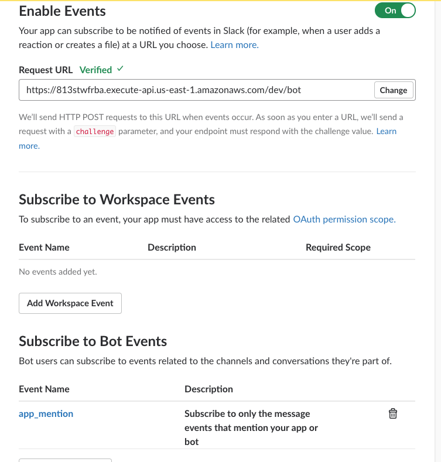

# Setting up Slack

Not going to lie, setting up this is kind of confusing but here we go!

1. [Login and create a workspace](https://slack.com/create)
2. Navigate to the Slack API and click [Create new App](https://api.slack.com/apps)



3. Click `Incoming Webhooks` and enable this.
4. Click `Add New Webhook to Workspace` and link this to your workspace
5. Copy the generated slack token:



6. At the root of the repo, duplicate the `.env.example` file and rename it to `.env`
```
cp .env.example .env
```
7. Place the slack token `TXXXXXXX/BXXXXX/HXXXXX` in the `.env` file:
```
SLACK_TOKEN=TXXXXXXX/BXXXXX/HXXXXX
```
8. Click and enable `Event Subscriptions`.
9. Paste in the POST Endpoint that was genearted from the `sls deploy` script
10. Under `Subscribe to Bot Events`, click `Add Bot User Event` and select `app_mention`




11. Click `Save Changes`
12. A Yellow alert bar will then appear at the top, you will have to reinstall the app to enable the newly updated permissions
